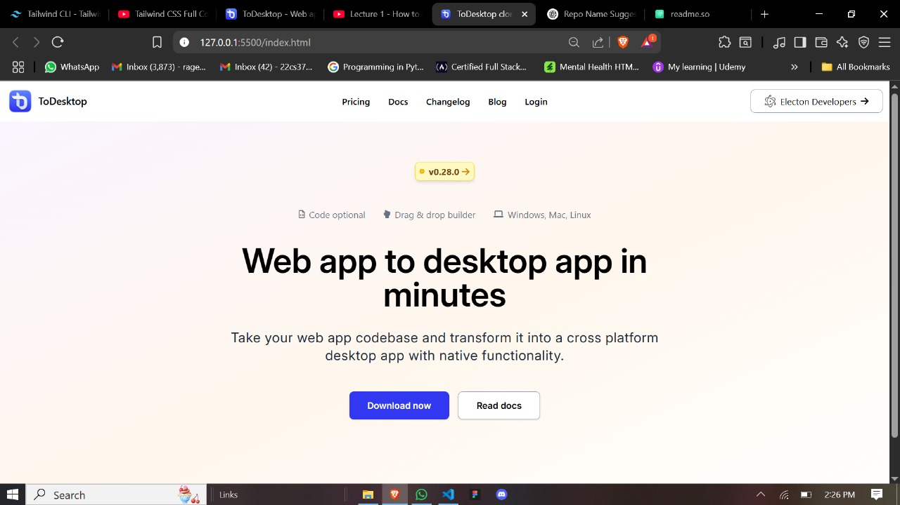
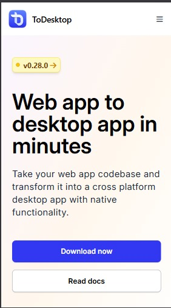

# 🖥️✨ ToDesktop Hero Section Clone

> 🔁 A pixel-perfect, responsive clone of the **ToDesktop** landing page hero section — crafted with 💚 Tailwind CSS & HTML.

---

## 🚀 Live Demo

🌐 **GitHub Pages Link:**  
[🔗 Click to View Demo](https://amank2601.github.io/Hero-ToDesktop-UI/)

---

## 📸 Preview

| 💻 Desktop View | 📱 Mobile View |
|----------------|----------------|
|  |   |

---

## 🧩 Features

✅ Sleek and modern UI inspired by ToDesktop  
✅ Mobile-friendly responsive design  
✅ Gradient background hero section  
✅ Interactive navigation menu (desktop + mobile)  
✅ Font Awesome & Material Icons used  
✅ Tailwind CSS styling  
✅ Clean & maintainable code  

---

## 🛠️ Built With

| Tech | Description |
|------|-------------|
| 🧱 **HTML5** | Semantic structure and layout |
| 🎨 **Tailwind CSS** | Utility-first CSS framework for styling |
| 🧰 **Font Awesome 6.7.2** | For interactive icons |
| 🔤 **Google Fonts & Material Symbols** | Typography and icon set |
| 🧪 **Responsive Design** | Mobile-first and cross-device compatible |

---

## 📂 Folder Structure

todesktop-hero-clone/

├── assets/images.png

├── output.css # Tailwind CSS build

├── index.html # Main file

├── style.css

├── script.js # Mobile menu toggle

└── README.md # This file